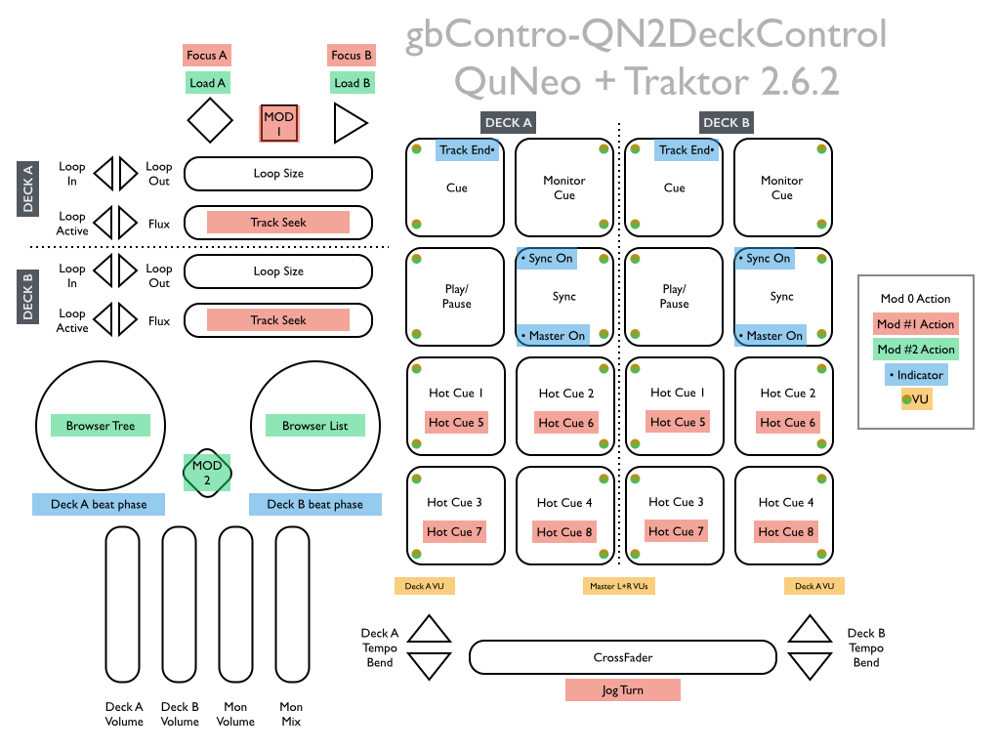

# Read Me

## gbControl-QN2DeckControl: Browse, cue, play.

Control the fundamentals of decks A and B in Traktor 2.6.2+.

Not intended to be "too clever", get your decks and cues running and control the flavor (EQ, filter, FX, etc) from another unit. Some fun elements, only a few isolated layers. Plenty of visual feedback.

This layout was designed as a main controller companion to a nanoKontrol2 for EQ/FX/Loop Recorder control:  
[gbControl-nk2TopBarTraktor](https://github.com/GreyBurkart/gbControl-nk2TopBarTraktor).

## Setup

1. Write the layout data to your QuNeo with the *.quneopreset file
2. Import the *.tsi file into Traktor
3. Check out the layout file (optional if you like suprises)
4. GLHF

CC-BY-SA 3.0, GB 2014  
Please distribute. Please improve. Credit me if you fork and/or distribute. Above all, distribute and improve on this template.

---

